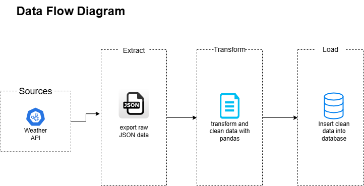

# Weather ETL Project

A Python-based ETL (Extract, Transform, Load) pipeline that automates the collection, processing, and storage of weather data from an API into a local database. This project demonstrates practical skills in Python programming, API integration, data transformation, and database management.

## Features

- **Data Extraction**: Retrieves weather data for multiple cities using a configurable API key.  
- **Data Transformation**: Ensures data consistency, handles missing values, and removes duplicates.  
- **Data Loading**: Stores the cleaned and processed data into a SQL database.  
- **Modular Architecture**: Separate extract, transform, and load steps for maintainability and scalability.  
- **Error Handling & Logging**: Implements robust logging and error management throughout the pipeline.  
- **Testing & Validation**: Includes unit tests to verify functionality and data integrity.  

## Learning Outcomes

Through this project, I gained hands-on experience with:

- **ETL Pipeline Design**: Building modular and maintainable data workflows.  
- **Python Data Handling**: Using libraries such as `pandas` and `SQLAlchemy` for data manipulation and database interaction.  
- **Configuration Management**: Secure handling of API credentials and configurable settings.  
- **Data Quality Assurance**: Cleaning and transforming raw API data for reliable analysis.  
- **Best Practices**: Implementing logging, error handling, and unit testing for production-ready code.  

## Folder Structure

```
weather-etl-pipeline/
├─ data/raw/          # Raw JSON data from API
├─ docs/
├─ logs/              # Log files
├─ notebooks/
├─ sql/
├─ src/
│  ├─ extract.py
│  ├─ transform.py
│  ├─ load.py
│  └─ utils/
│     ├─ etl_config.py
│     └─ logger.py
├─ config.env         # Environment variables
├─ main.py            # ETL entry point
└─ README.md
```


## Data Flow


- **Extraction**: Fetches coordinates and weather data for each city from OpenWeatherMap API, stored as JSON.  
- **Transformation**: Converts JSON into structured DataFrames, handles missing values, removes duplicates, maps AQI descriptions.  
- **Loading**: Writes DataFrames into SQL database tables (`air_pollution`, `current_weather`, `forecast_weather`).  

## Usage

### 1. Clone the Repository
```bash
git clone https://github.com/yourusername/weather-etl.git
cd weather-etl
```

### 2. Install Dependencies
```bash
pip install -r requirements.txt
```

### 3. Configure Environment Variables
Create a `config.env` file with your API key, database info, and cities.

Example:
```
OWM_API_KEY=your_openweathermap_api_key
CITIES=Athens,London,Paris
RAW_DIR=data/raw
UNITS=metric
HOST=localhost
DATABASE=weather_db
DRIVER=ODBC Driver 17 for SQL Server
```

### 4. Run the ETL Pipeline
```bash
python main.py
```

- Logs will be saved in `logs/etl.log`.  
- Raw JSON files will be saved in `data/raw/`.  
- Transformed data will be loaded into your SQL database tables.  

## Sample Output

Example of a transformed `current_weather` table:


## Dependencies

- `pandas`
- `SQLAlchemy`
- `requests`
- `python-dotenv`
- `pyodbc`

## Testing

To run unit tests (if included):
```bash
pytest tests/
```
